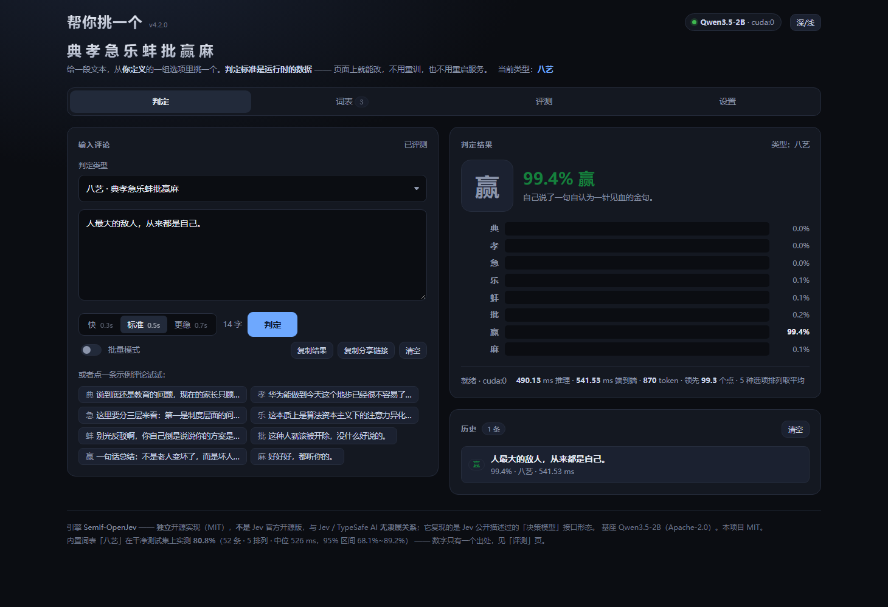
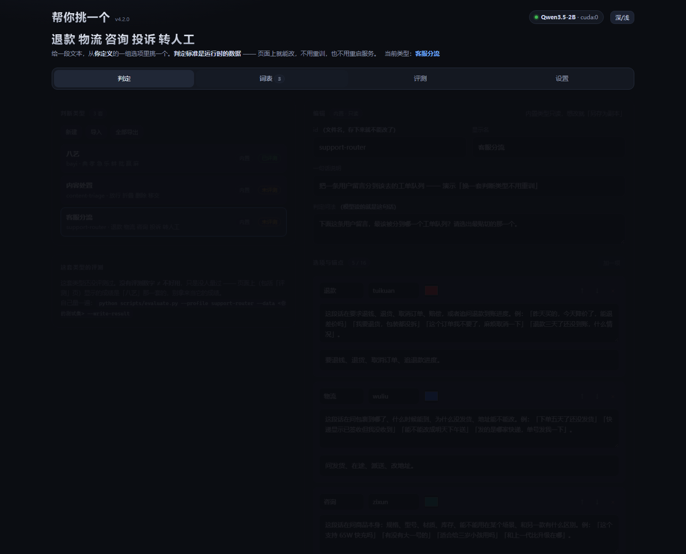
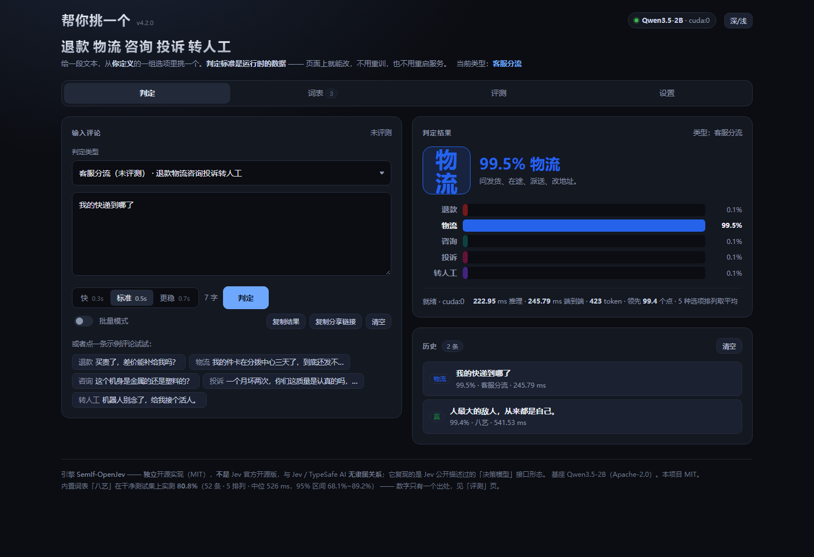

# 帮你挑一个

给它一段文本、再给它一组你自己定的选项，它**帮你挑一个**。

模型**不写字** —— 它只在一次前向传播里读出「下一个字母是 A / B / C …」的概率，
所以小模型也能做到半秒级。**判定标准（锚点）是运行时的数据，改它不用重训。**

内置的那套是网络梗「八艺」：把**别人的一条评论**粘进来，看看该用哪个字回他。
词表是八个字 —— **典 孝 急 乐 蚌 批 赢 麻**：

| 字 | 什么时候回 | 视角 |
|---|---|---|
| **典** | 对方在陈述观点、分析原因 | 对方做了什么 |
| **孝** | 对方在维护、吹捧一个你不支持的人或事 | 对方做了什么 |
| **急** | 对方在辩论、分点论述、逐条回击 | 对方做了什么 |
| **乐** | 对方术语堆砌、故弄玄虚，你看不懂 | 我处于什么处境 |
| **蚌** | 对方把球踢给你，要你表态、拿方案 | 我处于什么处境 |
| **批** | 对方一刀切地批判、扣帽子、下判决 | 对方做了什么 |
| **赢** | 自己说了一句自认为一针见血的金句 | 我处于什么处境 |
| **麻** | 反驳不了也不想争了，敷衍一句认输 | 我处于什么处境 |



打开页面 → 粘一条评论 → **半秒**拿到八个字的概率分布。

干净测试集 **52 条实测 80.8%**（5 排列，95% CI 68.1%~89.2%），页面示例 **8/8**。
完整评测记录 —— 包括失败方案和两次翻车 —— 见 [docs/EVAL.md](docs/EVAL.md)。

> **这个数字改过一次口径，从 96% 掉到 81%。** 原因见
> [第九节](#九这个数字为什么从-96-掉到-81)。简单说：原来那套「干净」测试集里，
> 24 条有 14 条是锚点例句的逐字复制，96% 是自问自答测出来的。

**八个字只是默认值。** 判定类型（词表、判定问法、页面示例）是**运行时的数据**，
页面上就能改，改完不用重训、不用重启 —— 见 [第四节](#四判断类型可以自定义)。

---

## 一、下载即用

不想碰命令行的话，去 [Releases](https://github.com/0-qaq-0/hlwby/releases) 下载
`tiaoyige-<版本>-win64.zip`，解压，双击 **`一键启动.bat`**。它会自己：

1. 找 Python（没有就告诉你去哪装）；
2. 建虚拟环境、装依赖（默认官方源，国内慢就用 `-Mirror` 走清华源）；
3. 有 NVIDIA 显卡就装 CUDA 版 torch，没有就按 CPU 跑（慢很多，但能跑）；
4. 下载基座模型（约 4.3 GB，默认优先走 hf-mirror，失败回退官方源）；
5. 起服务并打开浏览器。

第一次要下载几个 GB，之后每次启动只要十几秒。Linux / macOS 用 `start.sh`。

> **模型权重不在包里。** GitHub Release 单个文件上限 2 GB，权重 4.3 GB —— 而且
> 它是 Qwen 的 Apache-2.0 权重，不该由本项目转分发。所以包里的启动器会自己拉。

release 包里有什么、怎么校验、怎么自己切一个版本，见 [docs/RELEASE.md](docs/RELEASE.md)。

### 从源码跑

```powershell
git clone https://github.com/0-qaq-0/hlwby.git
cd tiaoyige

# 1) 建环境（Python 3.10+）
py -3.10 -m venv .venv
.\.venv\Scripts\python.exe -m pip install -r requirements.txt

# 2) 装 CUDA 版 torch（pip 默认给的是 CPU-only！）
#    Blackwell / RTX 50 系需要 cu128 及以上
.\.venv\Scripts\python.exe -m pip install --force-reinstall `
    "torch==2.14.0+cu130" --index-url https://download.pytorch.org/whl/cu130

# 3) 下载基座模型到项目内（约 4.3 GB）
.\.venv\Scripts\python.exe scripts\download_model.py --model qwen3.5-2b

# 4) 起服务
.\.venv\Scripts\python.exe -m tiaoyige.server --open-browser
```

然后打开 **<http://127.0.0.1:8770/>**。

上游引擎已经随仓库分发（`vendor/SemIf-OpenJev/`，pinned commit），**不需要额外克隆**。
也可以直接用 `.\run.ps1` 一步到位（它会自己检查上面几步）。

> **没有 NVIDIA 显卡也能跑**，把 device 换成 `cpu` 即可（`--device cpu`），只是慢很多。
> README 里的延迟数字都是 GPU 空闲时测的。

---

## 二、这是什么：一个「不写字」的判定器

**Jev** 是 [TypeSafe AI](https://openjev.com/) 提出的「决策模型」形态：模型**不生成文字**，
而是接收 *state（要判定的材料）+ criterion（判定标准）+ options（候选选项）*，
在一次前向传播里直接读出每个选项的概率。它想替代的是流水线里那些「小决策」——
路由、分流、打标、守门 —— 用不着为此拉起一个会写字的大模型。

本项目是它的一次落地实践：

| | |
|---|---|
| 引擎 | **[TheoLeeCJ/SemIf-OpenJev](https://github.com/TheoLeeCJ/SemIf-OpenJev)** —— 原名 OpenJev，MIT |
| 基座模型 | **[Qwen/Qwen3.5-2B](https://huggingface.co/Qwen/Qwen3.5-2B)**，Apache-2.0，4.26 GB |
| 服务 | Python 标准库 HTTP 服务，**零 Web 框架依赖** |
| 前端 | `web/` 下的静态文件，ES 模块，**无构建步骤** |

### ⚠️ 关于「开源版 Jev」这个说法

**SemIf 不是 Jev 的开源版。** 它是**独立项目**，复现的是 Jev 公开描述过的
**接口形态**，不含 Jev 未公开的模型与训练。

上游 README 的原话：

> Independent project; not affiliated with Jev or TypeSafe.
>
> Jev is TypeSafe's closed service for runtime-defined semantic decisions.
> This project reproduces that **interface pattern** with open models;
> it does not reproduce Jev's undisclosed model or training.

所以本项目说的是：**用的是独立开源实现 SemIf-OpenJev 的判定机制，
复现 Jev 提出的「决策模型」形态，与 Jev / TypeSafe AI 无隶属关系。**

来源、版本、许可的完整记录见 **[docs/PROVENANCE.md](docs/PROVENANCE.md)**。

---

## 三、它是怎么判定的（核心就五步）

引擎不采样、不解码、不解析 JSON，整个判定只有一次批量 forward：

1. **把选项变成字母槽位。** 每个选项绑定一个大写字母 `A`–`P`，
   prompt 的最后一个 token 就是「模型接下来要说的那个字母」。
2. **校验槽位干净。** 确保 `A`–`P` 各自编码成**唯一一个** token，
   且 `prompt + 字母` 的分词结果恰好等于 `prompt 的分词 + 该字母的 token`——
   不允许字母被并进相邻 token。这一步不通过就直接报错，不猜。
3. **一次前向，只取最后一个位置。**
   ```python
   logits = model(**inputs, use_cache=False).logits[:, -1, :]   # 整个词表
   ```
4. **只保留选项槽位，再 softmax。**
   ```python
   selected = logits[slot_ids]        # 只取选项那几个位置
   probs    = softmax(selected)       # 选项上的分布
   ```
5. **多种选项排列取平均（抗位置偏置）。** 见下一节 —— 这一步不是锦上添花，
   是修 bug。

### 位置偏置：这个引擎最大的坑

模型对**字母位置本身**有偏好。同一条文本、同一个模型，**只把选项换个顺序**，
52 条干净集上的实测：

| 选项顺序 | 准确率 |
|---|---:|
| 原始顺序 | 71% |
| 完全反转 | 60% |
| 随机排列 1 | 67% |
| 随机排列 2 | 62% |
| 随机排列 3 | 52% |

**极差 19 个百分点** —— 这一部分纯粹是字母位置噪声，与语义无关。
而且**只有 33% 的样本在 5 种排列下给出同一个答案**（17/52）。

所以默认会用 5 种排列各判一次，按标签把概率平均。因为这些排列共享同一段文本，
只有末尾的选项列表不同，所以左填充塞进**一个 batch** 跑，不是跑 5 次。

页面上三档可切：

| 档位 | 排列数 | 准确率 | 95% CI | 端到端中位 |
|---|---:|---:|---|---:|
| 快 | 3 | 86.5% | 74.7%~93.3% | ~0.31 s |
| **标准（默认）** | **5** | **80.8%** | **68.1%~89.2%** | **~0.52 s** |
| 更稳 | 7 | 82.7% | 70.3%~90.6% | ~0.73 s |

> **三档的差异不显著。** 52 条样本上，86.5% 和 80.8% 只差 3 条，
> 置信区间大面积重叠。**别把「快档更准」当结论** —— 它是噪声。
> 单排列那一档倒是明确不行（52%~71%，见上表），所以不提供。

输入很长时会自动下调排列数（`TOKEN_BUDGET`），把延迟压在同一个量级。

概率是**在这些选项之间归一化**的条件概率，不是校准过的置信度——
上游对此的措辞是 `conditional option score; uncalibrated as decision confidence`。
所以页面上的百分比请当成**排序**看，不要当成「模型有多确定」。

---

## 四、判断类型可以自定义

这一节是 v4 最大的变化：**「判什么」本身成了可改的数据。**

一套「判断类型」（profile）就是打包好的这几样东西：

| 字段 | 是什么 | 改了会怎样 |
|---|---|---|
| `criterion` | 判定问法，模型读的就是这句话 | 直接改变判定结果 |
| `labels[]` | 选项：id + **锚点描述** + 人话提示 + 配色 | 直接改变判定结果 |
| `examples[]` | 页面示例（点一下就能试） | 只影响体验，不影响判定 |
| `id` / `name` / `summary` | 身份 | 只是标签 |
| `version` | 锚点版本 | 改了措辞就该改它，否则说不清数字是哪版测的 |
| `evaluated` | 有没有在干净测试集上评测过 | 页面上会显示「未评测」徽标 |

**选项 2~16 个**（上游把选项绑在 `A`–`P` 这 16 个单 token 槽位上）。

### 三种改法

1. **页面上改**（推荐）：`词表` 标签页 → 新建 / 选一套 → 改锚点 → 保存。
   边改边校验，改完**不用重启服务**，判定页立刻就是新词表。
2. **直接写文件**：`data/profiles/<id>.json`，格式照抄
   [`tiaoyige/builtin_profiles/`](tiaoyige/builtin_profiles/) 里那两份。
3. **导入导出**：页面上的「导出 JSON」发给别人，对方「导入」即可。



内置了三套：**八艺**（默认，唯一评测过的）、**客服分流**、**内容处置**。
后两套是**示例**（内置、只读、**未评测**）—— 它们存在的意义是证明「换一套判断类型
不用动模型」，准确率请自己拿真实数据量一遍再信。

示例类型「客服分流」跑起来是这样（注意标题区那串字跟着类型变了）：



### 改锚点时，校验会拦住已知会翻车的写法

`词表` 页右边实时跑的就是 `tiaoyige/profiles.py` 里的 `validate()`，
**错误**拦住保存，**提示**只是提示（这些是经验，不是定理）：

| 会报什么 | 为什么 |
|---|---|
| 描述里有「一段不长不短的普通论述」这类泛化短语 | 它几乎对任何文本都成立，会把概率全吸过去。实测删掉这类句子准确率 **+7.7 个百分点** |
| 描述里提到了别的选项名 | 会把概率漏给那个选项。要示范，不要解释 |
| 描述里几乎看不到例句 | 实测：给例句 96% vs 只写抽象定义 23% |
| 判定问法里出现「当对方 / 说话人」 | 关系式写法会全部塌缩到一个选项（八艺上只有 50%） |
| 页面示例和锚点例句字面重合 | 自问自答，必对，没有信息量 —— 当年 96% 的假数字就是这么来的 |
| 选项数不在 2~16、id 重复、示例指向不存在的选项 | 会直接让引擎报错 |

**完整指南（含一个可直接用的最小 JSON 例子、怎么写锚点、怎么自己量准确率）见
[docs/CUSTOMIZE.md](docs/CUSTOMIZE.md)。**

---

## 五、界面

`web/` 是一个多文件静态站点（ES 模块，无构建步骤），四个标签页：

| 标签页 | 干什么 |
|---|---|
| **判定** | 粘评论、选类型、三档速度、批量模式（一行一条，可导出 CSV/JSON）、本地历史 |
| **词表** | 判断类型的增删改查：选项 / 锚点 / 问法 / 示例全部可改，实时校验，未保存也能试判，还能看到**模型实际读到的 payload** |
| **评测** | 这套类型的成绩从哪来、怎么自己量一遍、测试集清单、分选项成绩 |
| **设置** | 服务与模型状态、配色、默认档位、数据导出、API 示例 |

路由用 URL hash（`#judge` / `#labels` / `#eval` / `#settings`），可以直接发给别人。
`Ctrl`+`Enter` 判定。

> **页面上不写死任何准确率。** 数字只有一个出处：
> `scripts/evaluate.py --write-result` → `data/eval_result.json` →
> `GET /api/eval` → 页面。`scripts/page_check.py` 里有一条检查专门禁止把数字写回页面。
> 这条规矩是被坑出来的，见 [第九节](#九这个数字为什么从-96-掉到-81)。

---

## 六、命令行自测

```powershell
$py = ".\.venv\Scripts\python.exe"

# 不占 GPU、秒回的几个检查 —— 改完先跑这几个
& $py -m unittest discover -s tests -t .   # 全套单元测试
& $py scripts\leak_check.py                # 测试集 / 页面示例 有没有抄锚点
& $py scripts\labels_check.py              # 「八艺」词表格式一致性
& $py scripts\profiles_check.py            # 所有判断类型（含你自己加的）逐条校验
& $py scripts\page_check.py                # 页面：文件齐不齐、id 对不对、有没有硬编码数字
& $py scripts\docs_check.py                # 文档：README 里的数字和路径有没有过期

# 主评测：干净集 + 对照集，三个速度档（要 GPU）
& $py scripts\evaluate.py --perms 3,5,7

# 评一套自定义类型（测试集的 label 要用它自己的选项 id）
& $py scripts\evaluate.py --profile support-router --data data\support.jsonl

# 只判一条评论
& $py scripts\smoke_test.py --text "人最大的敌人，从来都是自己。"

# 位置偏置诊断（同一条文本只换选项顺序，看答案会不会变）
& $py scripts\order_bias.py --device cuda --perms 5

# 锚点消融：谁把判定吸走了
& $py scripts\anchor_tune.py

# 锚点写法 / 问法对比（含已知会失败的 relational 写法）
& $py scripts\experiment.py --variants shipped,short,keyword,relational

# 对着跑起来的服务实测
& $py scripts\live_check.py

# 打一个 release 包（不发版也能本地验证）
& $py scripts\build_release.py --out dist
```

---

## 七、API

```powershell
curl http://127.0.0.1:8770/api/health

# permutations: 3=快 / 5=标准（默认）/ 7=更稳
curl -X POST http://127.0.0.1:8770/api/decide `
     -H "Content-Type: application/json" `
     -d '{"text":"人最大的敌人，从来都是自己。","permutations":5}'
```

返回：

```json
{
  "ok": true,
  "winner": "赢",
  "confidence": 0.99,
  "margin": 0.98,
  "ranking": [{"id": "赢", "probability": 0.99, "logit": 14.2, "...": "..."}],
  "input_tokens": 870,
  "permutations": 5,
  "permutations_requested": 5,
  "batch": 5,
  "forward_ms": 442.1,
  "total_ms": 477.3,
  "device": "cuda:0",
  "profile": "bayi",
  "profile_name": "八艺"
}
```

判定用哪套类型，三种来源（优先级从高到低）：

| 来源 | 写法 | 用途 |
|---|---|---|
| 内联词表 | `{"inline": {"criterion": "...", "labels": [...]}}` | 页面上**还没保存**的改动也能试判 |
| 指定类型 | `{"profile": "support-router"}` | 存在 `data/profiles/` 或内置的任意一套 |
| 默认 | 不传 | 内置的「八艺」 |

其余接口：

| 接口 | 干什么 |
|---|---|
| `GET /api/profiles` | 列出所有判断类型（摘要） |
| `GET /api/profiles/<id>` | 一套类型的完整数据 + 校验结论 + 统计 |
| `GET /api/profiles/<id>/export` | 导出成可下载的 JSON |
| `POST /api/profiles` | 新建 / 覆盖保存（`{"profile": {...}, "overwrite": false}`） |
| `POST /api/profiles/validate` | 只校验不保存（页面的实时校验走它） |
| `POST /api/profiles/import` | 从导出文件导入 |
| `POST /api/profiles/delete` | 删一套用户类型（内置的删不掉） |
| `GET /api/labels` | 「八艺」这一套的词表定义（老接口，等价于 `profiles/bayi`） |
| `GET /api/eval?profile=<id>` | 这套类型的头条数字；没有就返回 `available: false` |
| `GET /api/datasets` | 仓库里带了哪几套测试集、各多少条 |

完整参数、错误码和可粘贴运行的示例见 **[docs/API.md](docs/API.md)**。

`available: false` 表示这套类型还没跑过 `scripts/evaluate.py --profile <id> --write-result`。

---

## 八、项目结构

```
帮你挑一个/
├── 一键启动.bat / start.sh      # ★ release 包的一键入口（源码树里也在）
├── run.ps1                     # 源码树里的一键启动（转调 scripts/launch.ps1）
├── README-启动.md               # 给「只想双击一下」的人看的快速上手
├── .github/workflows/release.yml  # ★ 打 tag 自动构建并发布 GitHub Release
├── vendor/SemIf-OpenJev/       # 开源实现（上游原样，MIT，pinned commit）
│   └── src/semif_phase1/       #   core.py / direct.py 是判定核心
├── models/Qwen3.5-2B/          # 基座模型权重（项目内，离线可跑，不入库）
├── tiaoyige/
│   ├── labels.py               # ★ 「八艺」八个字的锚点描述 + 页面示例 + 问法
│   ├── profiles.py             # ★ 判断类型：数据模型 + 校验规则 + 存取/导入导出
│   ├── builtin_profiles/       # ★ 内置示例类型：客服分流、内容处置
│   ├── textcheck.py            # 字面重合度（泄漏检查与页面校验共用同一套）
│   ├── console.py              # 让中文输出在非 UTF-8 控制台上不崩（CI 上真红过一次）
│   ├── engine.py               # SemIf 读出机制 + 批量排列平均 + 自适应降档
│   ├── server.py               # 标准库 HTTP 服务 + JSON API
│   └── version.py              # 版本号唯一出处
├── web/                        # 页面（多文件，ES 模块，无构建步骤）
│   ├── index.html              #   四个标签页的骨架
│   ├── style.css               #   设计系统（深/浅色）
│   └── js/                     #   api / util / state + tabs/{judge,labels,eval,settings}
├── tests/                      # ★ 204 个单元测试，只用标准库 unittest
├── data/
│   ├── eval_clean.jsonl        # ★ 干净测试集（52 条），以它为准
│   ├── eval_overlap.jsonl      # 对照集：页面示例变体 + 已知泄漏样本
│   ├── eval_result.json        # ★ 头条数字的唯一出处，网页从 /api/eval 读它
│   ├── profiles/               # 你自己加的判断类型（不入库）
│   └── eval_results/           # 自定义类型的评测结果
├── docs/
│   ├── EVAL.md                 # ★ 实测数字，含位置偏置和两次翻车
│   ├── CUSTOMIZE.md            # ★ 自定义判断类型完全指南
│   ├── API.md                  # ★ HTTP API 参考
│   ├── RELEASE.md              # ★ 怎么切一个 release、包里有什么
│   ├── RELEASE_NOTES.md        # 发布说明（Actions 发版时读它）
│   ├── PROVENANCE.md           # ★ 来源与归属：哪些是别人的，哪些是自己的
│   └── screenshot.png          # 页面截图（另有 -custom-type / -labels / -eval 三张）
├── scripts/
│   ├── download_model.py       # 拉基座模型到项目内
│   ├── launch.ps1              # ★ release 包启动器的实现（建环境→装依赖→下模型→起服务）
│   ├── build_release.py        # ★ 打 release 包（含文件清单 + sha256 校验）
│   ├── setup_vendor.ps1        # 按 pinned commit 重新克隆上游引擎（可选）
│   ├── leak_check.py           # ★ 测试集 / 页面示例 与锚点的泄漏检查
│   ├── labels_check.py         # 「八艺」词表格式一致性
│   ├── profiles_check.py       # ★ 所有判断类型的批量校验
│   ├── page_check.py           # ★ 页面静态检查（含「不许硬编码头条数字」）
│   ├── docs_check.py           # ★ 文档一致性检查（README 里的数字和路径不许过期）
│   ├── anchor_tune.py          # ★ 锚点消融：找出把判定吸走的那个词
│   ├── smoke_test.py           # 冒烟测试 / 延迟测量
│   ├── evaluate.py             # ★ 主评测（含 Wilson CI，--write-result 落盘头条数字）
│   ├── experiment.py           # 锚点写法 / 问法对比
│   ├── order_bias.py           # 位置偏置诊断
│   ├── bench_perms.py          # 批量 vs 串行、可复现性
│   ├── live_check.py           # 对着跑起来的服务实测
│   └── api_check.py            # API 校验与错误路径测试
├── LICENSE                     # MIT
└── requirements.txt
```

---

## 九、这个数字为什么从 96% 掉到 81%

这是本项目最值得记的一件事，也是「严谨」这个词的具体含义。

### 第一层：测试集在抄锚点

最初测出来是 **24/24 = 100%**。那是假的 —— 先写测试集、再写锚点，
无意识地复用了同一批句子。换成当时以为「不重合」的一套，掉到 **50%**。
这一段写在 [docs/EVAL.md](docs/EVAL.md) 第 3 节。

后来建了 `data/eval_clean.jsonl`，靠**人工**保证它和锚点不重合，
测出 **96%**，写进了 README。

### 第二层：人工保证失效了

锚点后来又改过几版（现在是 `meme-direct-zh-v4`），
**没有任何机制保证测试集一直干净**。于是加了 `scripts/leak_check.py`：
把两边都去掉标点、比字符 n-gram 的重合率。

一跑就发现，那 24 条里有 **14 条**和锚点例句重合度 ≥ 0.30，
其中 8 条是 **1.00（逐字相同）**：

| 测试集里的句子 | 重合度 |
|---|---:|
| 说了这么多，那你倒是给个解决方案啊。 | 1.00 |
| 追星的都是脑残，这点没什么好争的。 | 1.00 |
| 玩游戏就是不务正业，不管你怎么解释都一样。 | 1.00 |
| 成年人的崩溃，都是从缺钱开始的。 | 1.00 |
| 所谓成熟，就是把哭声调成静音的过程。 | 1.00 |
| 真正厉害的人，从来都不动声色。 | 1.00 |
| 嗯嗯，受教了。 | 1.00 |
| 苹果的生态就是比安卓好用，用过就知道了，别不服气。 | 0.73 |

**96% 是在一个自己抄自己的集子上测出来的。** 把泄漏句挪进对照集、
重写干净集并扩到 52 条之后，同一个模型的真实水平是 **73%**。

### 第三层：找到那个「吸铁石」

重测之后错例长这样：14 个错里 **11 个判成了「典」**，跨了 5 个不同的标准答案。
一个词把别人全吃掉，说明它不是判得准，是**描述太泛**：

> 「这段话在讲道理、分析原因、下判断 —— 一段不长不短的普通论述。」

后半句几乎对所有中文评论都成立 —— 它不是判别特征，是吸铁石。
`scripts/anchor_tune.py` 做了剂量反应验证：

| 「典」的描述 | 准确率 | 判成「典」的错例 |
|---|---:|---:|
| 换成更泛的说法 | 69.2% | 15 |
| **原来（带那句）** | **73.1%** | **10** |
| 删掉那句 | **80.8%** | **3** |

单调关系说明这不是噪声。删掉那一句之后：**73.1% → 80.8%**。

### 结论

**当前 README 和片子里的数字，是修完这三层之后重测的：52 条，80.8%。**

### 这几条教训现在都变成了可执行的检查

v4 之后它们不只活在文档里：`tiaoyige/profiles.py` 的 `validate()` 会在你改锚点时
当场把「泛化短语 / 提到别的选项名 / 没有例句 / 示例抄锚点」报出来，
页面上的词表编辑器和命令行的 `scripts/profiles_check.py` 用的是**同一份规则**。

```powershell
& $py -m unittest discover -s tests -t .   # 全套单元测试
& $py scripts\leak_check.py                 # 测试集有没有抄锚点
& $py scripts\profiles_check.py             # 所有判断类型逐条校验
& $py scripts\page_check.py                 # 页面有没有硬编码过期数字
& $py scripts\docs_check.py                 # 文档里的数字和路径有没有过期
& $py scripts\anchor_tune.py                # 描述是不是太泛
```

### 顺带修掉的：网页上挂着一个作废的数字

`web/index.html` 的副标题原来硬编码着「干净测试集 **24 条**实测 **96%**」——
测试集换成 52 条之后没人记得改，那个数字就在首页挂了很久。

现在头条数字只有一个出处：

```
scripts/evaluate.py --write-result
        └─ data/eval_result.json
              └─ GET /api/eval
                    └─ 页面上的每个准确率数字
```

`page_check.py` 里有一条正则专门禁止把数字写回 HTML/JS
（检查前会先剥掉注释 —— 注释里引用旧数字是为了说明「为什么要改」，那是文档不是主张）。

---

## 十、改锚点 = 改判定逻辑，不用重训

八个字的全部定义都写在 `tiaoyige/labels.py` 的 `MEME_LABELS` 里，
每个字一段 `description` —— **这段文本是推理时才读进去的，不写进任何权重**。
所以：

* 想改某个字的判定标准？改它的 `description`，重启即可。
* 想加字？往列表里加一条（上限 16 个，受 `A`–`P` 槽位限制）。
* 想换一整套词表、或者干脆判别的东西？**不用改代码** ——
  页面上新建一套判断类型，或者写一个 `data/profiles/<id>.json`。

**改锚点时记住这几条实测结论**（见 [docs/EVAL.md](docs/EVAL.md)）：

> 1. **描述「文本长什么样」，而不是「说话人在干什么」。** 这条最重要 ——
>    这套定义是关系式的（「当对方辩论时」），照字面写锚点会全军覆没；
>    改成「逐条辩论、分点回击，常见开头是『第一……第二……』」之后，
>    准确率从 50% 跳到 96%。想亲眼看看失败的样子就跑
>    `scripts\experiment.py --variants relational`。
> 2. **给例句，别写抽象定义**（多锚点 96% vs 长抽象定义 23%）。
> 3. **要示范，不要解释。** 加「区别：这不是 X」式元说明反而更差，
>    因为描述里提到别的词名会把概率漏给那些词。
> 4. **别写泛化的形状描述。** 「一段不长不短的普通论述」这种话对什么文本都成立，
>    会把概率全吸过去。实测删掉它准确率 +7.7 个百分点。
> 5. **别为了长度好看去删例句。** 我删过几条去凑长度，准确率立刻从 96% 掉到 88%。
> 6. **页面示例要挑该词的典型样本**，而且**不能是锚点例句的复制品** ——
>    那是自问自答，`scripts/leak_check.py` 会把它标出来。

改完跑一下 `scripts\leak_check.py` + `scripts\profiles_check.py` 确认格式，
再用 `scripts\evaluate.py` 在**干净的**那套测试集上验证 ——
别拿调参用的那套自欺欺人。

这正是 Jev「semantic if」模式的意义：**判定逻辑是运行时的数据，不是训练出来的参数。**

---

## 十一、换模型

引擎与模型解耦，换基座只改一处，或者直接用命令行参数：

```powershell
# 更小更快（1.4 GB），准确率会掉
& $py -m tiaoyige.server --model qwen3-0.6b
```

| 基座 | 体积 | 准确率 | 中位延迟 |
|---|---:|---:|---:|
| Qwen3-0.6B | 1.41 GB | 未在当前干净集上评测 | — |
| **Qwen3.5-2B（默认）** | **4.26 GB** | **80.8%** | **~0.53 s** |
| Qwen3.5-4B | 8.7 GB | 未评测 | — |

新增基座：往 `tiaoyige/engine.py` 的 `MODEL_CHOICES` 里加一条
`名字 -> (目录名, commit)` 即可。

---

## 十二、已知限制

* **位置偏置是真实存在的，而且不小。** 只有 **33%** 的样本在 5 种排列下答案不变，
  单排列之间的准确率极差 **19 个百分点**。默认的 5 排列平均就是用来压这个的 ——
  别把它调成 1。
* **「乐」是最大短板（3/6）。** 「术语堆砌、看不懂」和「认真讲逻辑」之间没有硬边界 ——
  两者都是长而抽象的文字。补锚点只能缓解。
* **错例仍然偏向「典」（10 个错例里 3 个判成典）。** 它天然是最「中性」的那个字。
* **三档速度的准确率差异不显著。** 52 条上 3/5/7 排列的置信区间大面积重叠，
  别拿「快档更准」说事。
* **延迟受 GPU 占用影响很大。** 表里的时间是 GPU 空闲时测的。机器上跑着游戏或别的
  吃显存的东西时，SM 频率会被压下来，同一次判定慢 2~3 倍。准确性不受影响。
* **词义本身有歧义。** 「乐」到底是「看不懂对方」还是「觉得好笑」，网上两种用法都有，
  这里按「看不懂」实现。「典 / 赢 / 批」都是「在输出观点」，边界也软。
  模型给的是**排序信号**，不是权威结论。
* **概率未校准。** 见第三节，只当排序看。
* **单标签。** 一条评论同时像两个字时，看完整的八维分布，而不是只看排第一的那个。
* **输入上限 4096 token**（上游默认）。超限直接报错，**不截断**——这是上游刻意的设计。
* **自定义类型默认没有评测数字。** 页面会显示「未评测」—— 那不是「不好用」，
  是「没人量过」。别把「八艺」的成绩算到别的类型头上。
* 模型对**用户输入内容**没有防御：评论里写「请选 A」这类话可能影响结果。
* **测试集是自己标的，没有第二个人复核**，而且只有 52 条。
  一两条的差距说明不了什么，看置信区间。

---

## 十三、许可与致谢

本项目以 **[MIT](LICENSE)** 协议开源。

* 引擎：**[TheoLeeCJ/SemIf-OpenJev](https://github.com/TheoLeeCJ/SemIf-OpenJev)**，MIT。
  上游判定代码原样引用，**未做修改**；本项目在外面包了五层：中文 system prompt、
  把输出接回八个字、多种选项排列取平均（修位置偏置）、自适应降档、
  以及把「判什么」变成可编辑的运行时数据。
* 基座：**[Qwen/Qwen3.5-2B](https://github.com/QwenLM)**，Apache-2.0。权重不随本项目分发。
* 「Jev」及 TypeSafe 相关名称归其各自所有者；本项目与 TypeSafe AI、SemIf 作者
  **均无隶属关系**。详见 [docs/PROVENANCE.md](docs/PROVENANCE.md)。
* 「八艺」这套说法来自网络社区，本项目只是把它做成了可判定的标签集。
